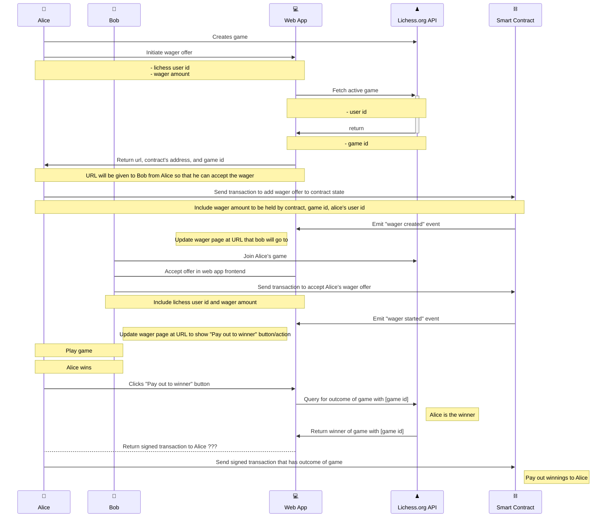

<!-- PROJECT LOGO -->
<br />
<div align="center">
  <h3 align="center">Smart Contract wagers example</h3>
</div>

<!-- TABLE OF CONTENTS -->
<details>
  <summary>Table of Contents</summary>
  <ol>
    <li>
      <a href="#about-the-project">About The Project</a>
      <ul>
        <li><a href="#built-with">Built With</a></li>
      </ul>
    </li>
    <li>
      <a href="#getting-started">Getting Started</a>
      <ul>
        <li><a href="#prerequisites">Prerequisites</a></li>
        <li><a href="#installation">Installation</a></li>
      </ul>
    </li>
    <li><a href="#usage">Usage</a></li>
  </ol>
</details>

<!-- ABOUT THE PROJECT -->

## About The Project

This project includes an implementation of a Smart Contract that could be used alongside a frontend application to allow users to engage in wagers

<p align="right">(<a href="#top">back to top</a>)</p>

### Built With

This section should list any major frameworks/libraries used to bootstrap your project. Leave any add-ons/plugins for the acknowledgements section. Here are a few examples.

- [Solidity](https://github.com/ethereum/solidity)
- [Brownie](https://github.com/eth-brownie/brownie)
- [Ganache](https://github.com/trufflesuite/ganache)
- [Python3](https://www.python.org/downloads/) _Python 3.6 or greater_

<p align="right">(<a href="#top">back to top</a>)</p>

<!-- GETTING STARTED -->

## Getting Started

### Prerequisites

1. Install [Brownie](https://github.com/eth-brownie/brownie#installation)
2. Install [Node.js >= v10.13.0](https://nodejs.org/en/about/releases/) and npm >= 6.4.1.
3. Install [Gananche-cli 6.12.2](https://github.com/trufflesuite/ganache#command-line-use)
   ```
   npm install ganache@6.12.2 --global
   ```
   Note: In order to work with the current version (As of 10/8/2021) you may have to rename your binary file for `ganache` to `ganache` from `ganache- cli`

### Installation

<p align="right">(<a href="#top">back to top</a>)</p>

## Usage

1. `brownie test` to run tests
2. `brownie console` to run console
3. https://eth-brownie.readthedocs.io/en/latest/quickstart.html

<p align="right">(<a href="#top">back to top</a>)</p>


### Diagram


